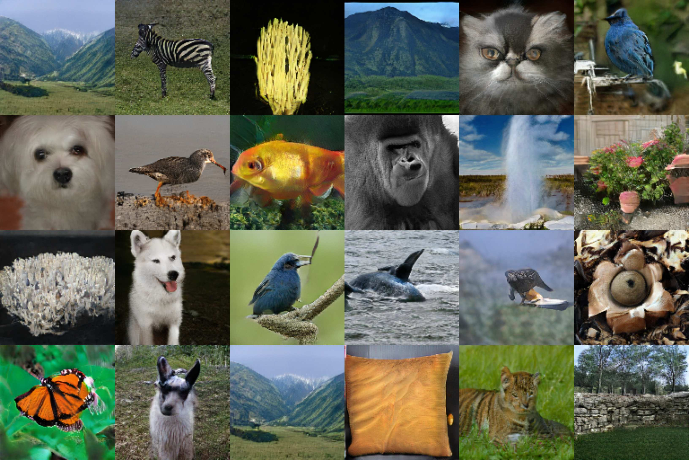
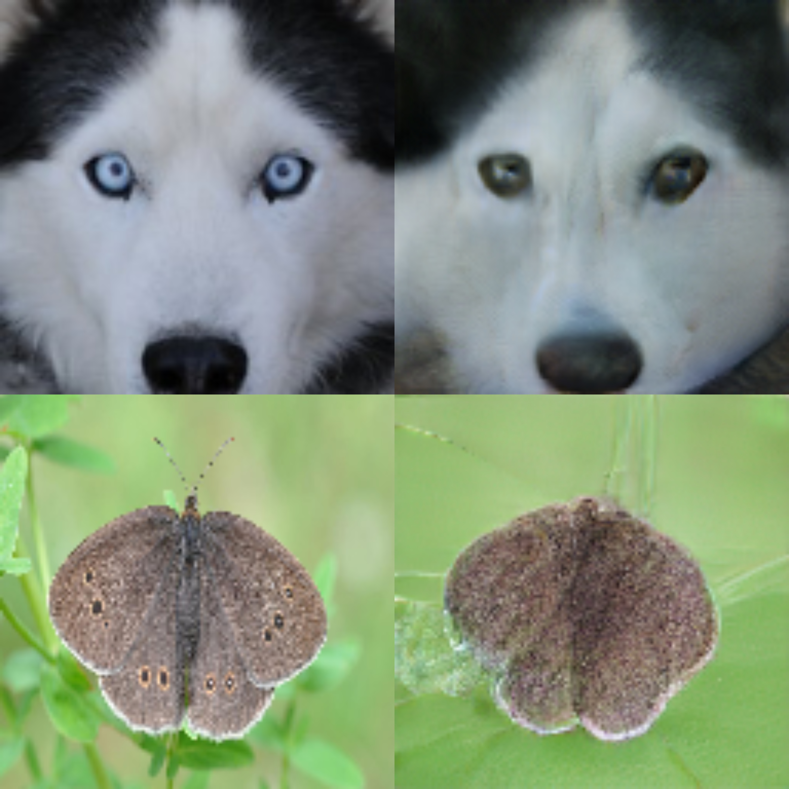
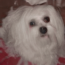

##  Your Locan GAN &mdash; Designing Two Dimensional Local Attention Mechanisms for Generative Models



*Images generated by YLG - SAGAN after 1M steps training on ImageNet.*


*Left: Real image, Right: Inverted image using our technique.*



*Generated gif from interpolating latent variables for maltese dogs.*

## Installation
We recommend installing YLG using an Anaconda virtual environment.
For installing Anaconda refer to the [official docs](https://docs.anaconda.com/anaconda/install/).

First, create a new virtual environment with Python 3.6:

```
conda create -n ylg python=3.6
conda activate ylg
```

Next, install the project requirements:
` pip install -r requirements.txt `


### Pre-trained models
We make available pre-trained model for YLG SAGAN, after 1M steps training on ImageNet.

If you want to try the model, download it from [here](https://drive.google.com/open?id=1Nikmw2WLcSnN_Yv0FbvwrZcjgu-HPkJH).
We recommend saving the pre-trained model under the `ylg/` folder, but you can also choose another location and set the `pretrained_path` appropriately.


## Explore our model

### Generate images
Generating images for any category of the ImageNet dataset is one command away.

Just run: `python generate_images.py --category=eskimo_husky` to generate eskimo huskies! For a complete list of the categories names, please check `categories.py` file.

There are several parameters that you can control, such as the number of generated images. You can discover them by running: `python generate_images.py --help`

As you can see, the model is able to generate some really good-looking images, but not all generated images are photo-realistic. We expect that training bigger architectures, such as BigGAN, with our 2-d local sparse attention layers, will improve significantly the quality of the generated images.


### Invert your own images
In our paper, we present a new inversion technique: we extract a saliency map for the real image out of the attention layer of the Discriminator and we use it to weight a novel loss function in the discriminator's embedding space.

To the best of our knowledge, inversion of big models with attention is achieved in a satisfying degree.
You are one command away of trying it out!

Just run: `python inverse_image.py` to invert a cute maltese dog that is saved in the `real_images/` folder. You can run with your own images as well! `python inverse_image.py --image_path=<path> --category=<path>` is the command to run.


## Acknowledgments
The code of this repository is heavily based in the [tensorflow-gan](https://github.com/tensorflow/gan) library. We add the library as a dependency and we only re-write based on the original code the parts that need to be modified for YLG.
